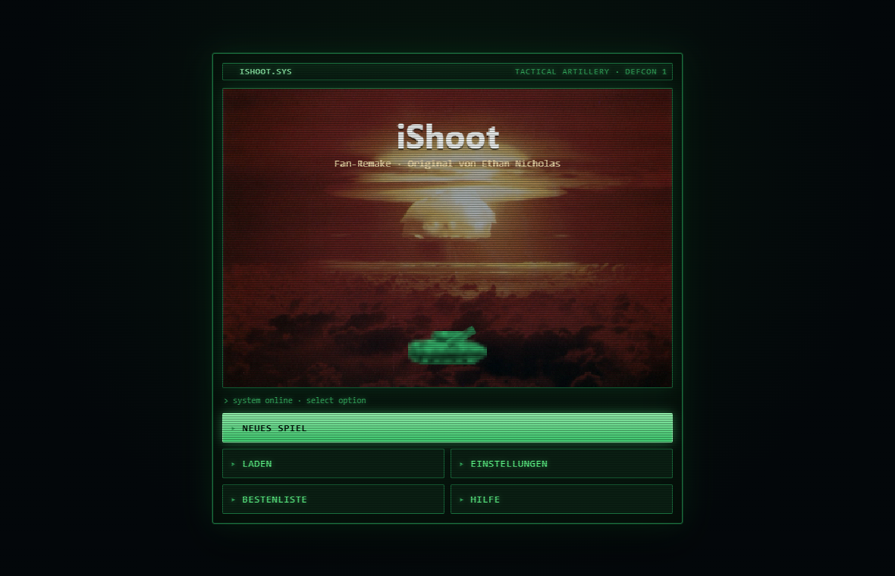
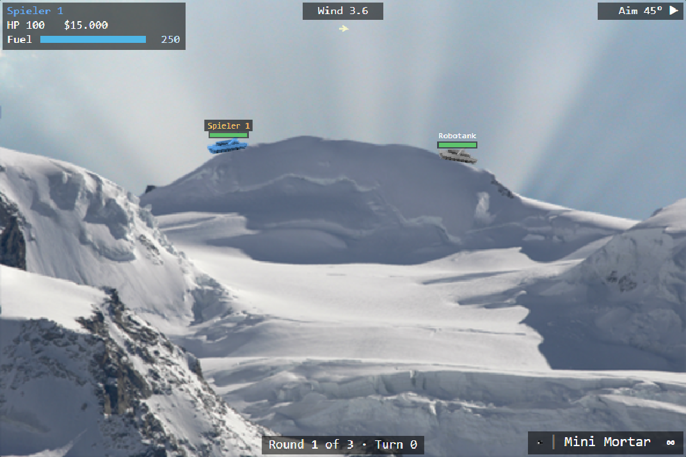
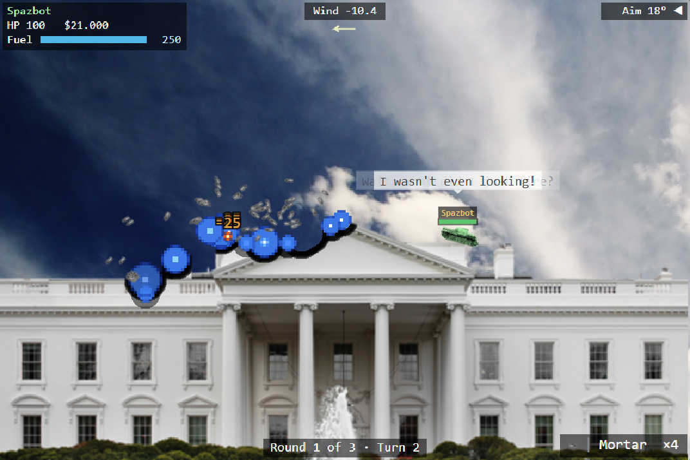
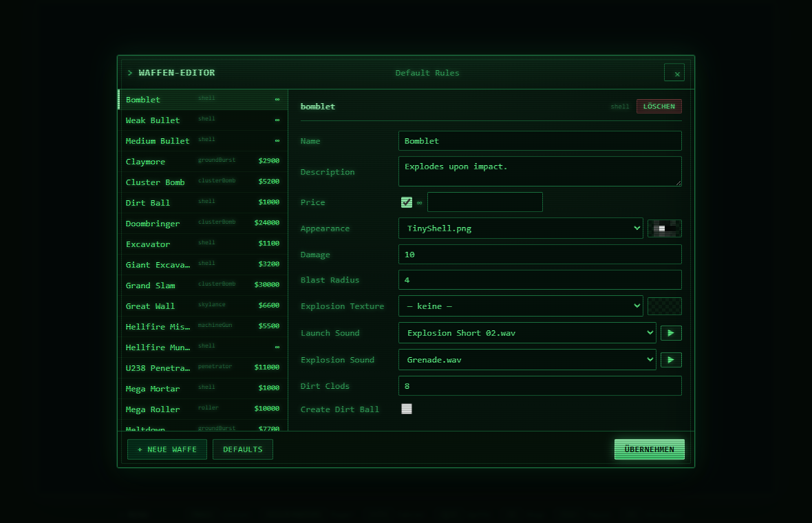
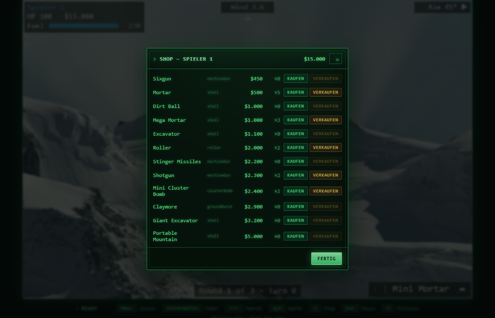

# iShoot — Legacy Remake

A faithful, browser-based remake of **iShoot**, the classic 2D artillery game
originally created by **Ethan Nicholas** for iOS back in 2008. Rebuilt from the
ground up in plain HTML5 + JavaScript (Canvas 2D, ES modules) — no frameworks,
no build step, no dependencies. Just open it and play.

> This is a non-commercial fan project made for preservation and personal
> enjoyment. All credit for the original game — its design, weapons, characters
> and artwork — belongs to Ethan Nicholas. See **[Credits & Legal](#credits--legal)**.



## What is it?

iShoot is a turn-based artillery duel in the spirit of *Scorched Earth* and
*Worms*: line up your shot, hold to charge the power, read the wind, and rain
ordnance on your opponents across fully destructible terrain. Earn cash for
damage and kills, then spend it in the shop on bigger and nastier weapons.

|  |  |
|---|---|
|  |  |
|  |  |

## Features

- **Pixel-perfect destructible terrain** with cascading falling dirt.
- **65+ weapons** across multiple rule sets — shells, cluster bombs, rollers,
  ground bursts, penetrators, sky lances, nukes, machine guns and randomized
  multi-colour bomblets, plus an "All Weapons" sandbox mode.
- **Terrain-building weapons** (Dirt Ball, Great Wall, Portable Mountain).
- **CPU opponents** with three difficulty levels that aim, drive, pick weapons
  and shop more aggressively the harder they get.
- **In-game Shop** — buy and sell weapons with the cash you earn.
- **Full Weapon Editor and Rule Editor**, recreating the original's tooling with
  quality-of-life extras: live sprite previews, sound previews and submunition
  editing.
- **Lots of battlefields**, including bonus landmark maps, with random skies and
  ground textures.
- **Tank personalities** with taunts and one-liners.
- **Local save/load** slots and a profile/leaderboard board.
- **Music & sound effects**, with a settings panel for volume, render
  resolution and full keyboard/mouse rebinding.
- **CRT / military-terminal themed UI.**
- **Scalable internal render resolution** (1×–3×) for crisp craters at any size.

### Intentionally left out

Online and platform-specific features of the original are deliberately omitted:
Scoreloop, online multiplayer, Facebook friends, country flags, online
leaderboards and in-app purchases.

## Play it

The game uses ES modules and `fetch()`, so it has to be served over HTTP — it
won't run from a `file://` URL. Any static web server will do.

**Option A — included Python server**

```bash
python serve.py
```

Then open <http://127.0.0.1:8080/>.

**Option B — Python's built-in server**

```bash
python -m http.server 8080
```

**Option C — Node**

```bash
npx serve .
```

Open the printed URL in a modern browser (Chrome, Edge, Firefox, Safari).

### Controls

| Input | Action |
|---|---|
| **Mouse** | Aim the barrel |
| **Click & hold** | Charge shot power, release to fire |
| **← / →** | Drive (costs fuel) |
| **Q / E** | Switch weapon |
| **S** | Open the shop |
| **Esc / Space** | Pause |
| **H** | Toggle hitbox overlay |

## Project structure

```
index.html        entry point
serve.py          tiny static dev-server
src/engine/       game loop, input, asset loader, rendering helpers
src/game/         terrain, weapons, tanks, AI, match/round logic
src/ui/           title screen, menus, HUD, shop, weapon & rule editors
data/             game configuration (rules, weapons, tanks, landscapes)
assets/           sprites, audio and backgrounds
test/             unit tests for the terrain engine
docs/screenshots/ images used in this README
```

## Credits & Legal

- **Original game, design & assets:** **Ethan Nicholas** — *iShoot* (2008).
  iShoot is one of the legendary early App Store success stories, and this
  remake exists out of admiration for it. All rights to the original game and
  its assets remain with the original author.
- This project is an independent reimplementation of the game's mechanics in
  JavaScript for the browser. The bundled artwork, audio and game-data files
  come from the original game and are included in good faith, purely for
  preservation and personal play. **If you hold the rights and would like this
  material removed, please open an issue and it will be taken down.**
- **Remake source code:** released under the [MIT License](LICENSE). The MIT
  license applies to this remake's own source code only — not to the original
  game's assets or intellectual property.
